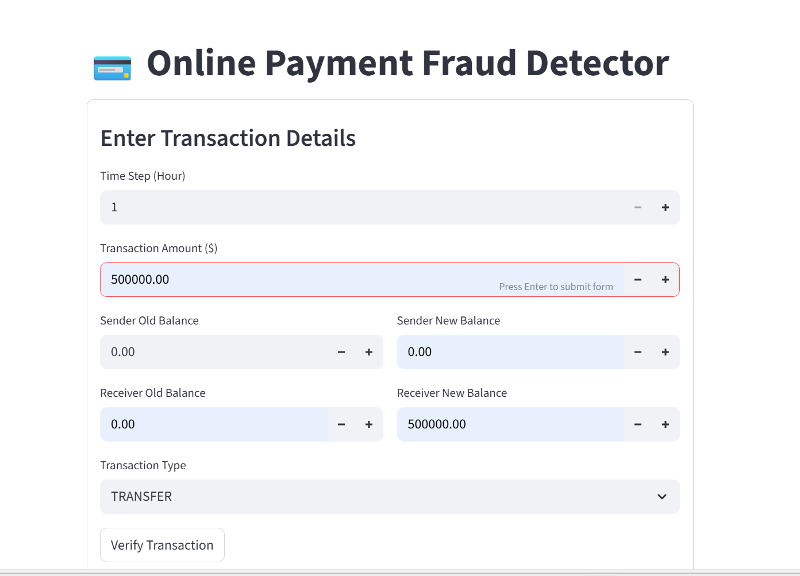

# Online Payment Fraud Detection 

An interactive Machine Learning application designed to detect fraudulent transactions in real-time. This project uses a Python backend for data processing and a Streamlit frontend for a seamless user experience.

## 🚀 App Preview
(detect.png) 
*Real-time prediction interface showing a "Not Fraudulent" result.*

## ✨ Features
* **Instant Detection:** Predicts fraud status immediately upon entering transaction data.
* **ML Integration:** Utilizes pre-trained model weights (`fraud_model.json`) for high accuracy.
* **User-Friendly UI:** Clean, dark-themed interface built with Streamlit.

## 📁 Project Structure
* **Backend/**: Contains `main.py` (logic), `model.py` (model loading), and model files.
* **Frontend/**: Contains `app.py` for the web interface.
* **.gitignore**: Optimized to keep large datasets and virtual environments out of the repo.

## 🛠️ Setup & Installation
1. **Clone the repo:**
   ```bash
   git clone [https://github.com/Anchal1811/Online-fraud-detection.git](https://github.com/Anchal1811/Online-fraud-detection.git)
