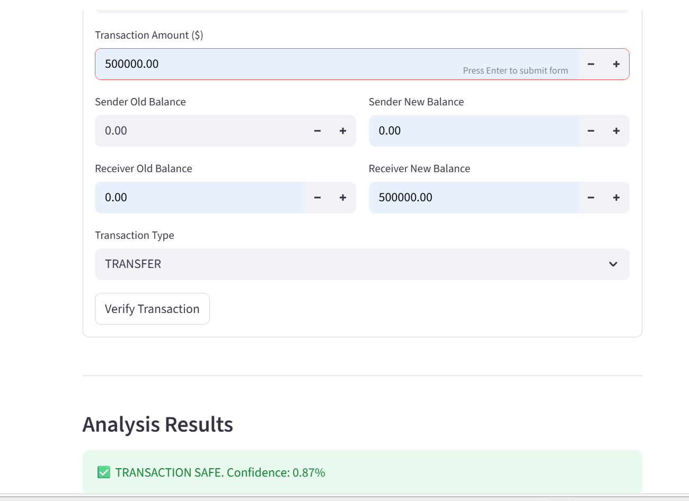

# 🛡️ Online Payment Fraud Detection

An end-to-end Machine Learning application designed to identify fraudulent transactions. This project features a Python backend for data processing and a Streamlit frontend for real-time user interaction.

## 📊 App Preview

*Real-time prediction interface for transaction analysis.*

*Result display for fraudulent vs. legitimate transactions.*

## 📁 Project Structure
* **Backend/**: Contains `main.py` (logic), `model.py` (loading), and model files (`.json`, `.npy`).
* **Frontend/**: Contains `app.py` for the web interface.
* **.gitignore**: Configured to exclude heavy virtual environments and large datasets.

